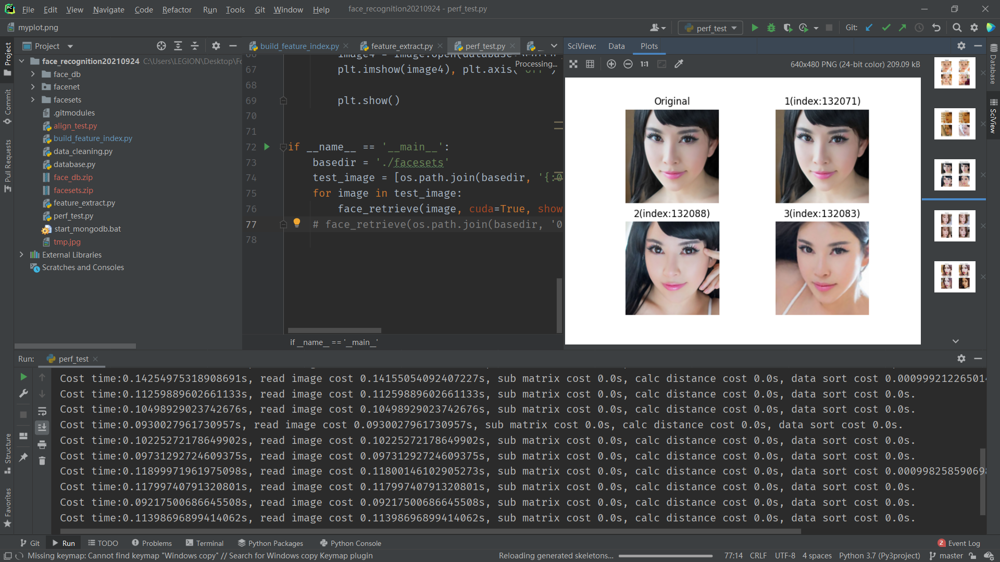

#  基于facenet-pytorch实现的人脸检索

###  需要安装的软件

python（推荐3.7+版本）

mongodb

CUDA（推荐、非必须）

Pytorch（推荐GPU版本）

###  具体使用说明

1. clone本仓库到本地
2. clone [facenet-pytorch仓库](https://github.com/timesler/facenet-pytorch)到本仓库根目录下
3. 下载人脸图片数据集和人脸特征数据库到本地仓库目录（[特征数据库 提取码36q2](https://pan.baidu.com/s/1mrwpQ8H60vjlBXIQpSh29w)  [人脸数据集 提取码zbq8](https://pan.baidu.com/s/166wToy8ioTvns2YC5xSFJg )）
4. 解压下载的两个压缩文件（保持文件夹原名）
5. 下载安装mongodb，并把mongodb的bin目录置于环境变量中
6. 安装CUDA（可选）
7. 安装本项目所需要的第三方库，如使用anaconda，其自带库包含大部分所需
8. 运行本地目录下start_mongodb.bat，启动特征数据库
9. 运行项目的perf_test.py，程序会自动从人脸数据集中随机选择20张人脸并通过特征匹配得到这20张人脸的近似人脸

###  实现效果

图中Original表示要比对的人脸，1、2、3分别表示第一、二、三接近的人脸。

实测数据库中一共136719张人脸特征向量，从硬盘中读取到内存并组建为特征矩阵所需的时间大概为11秒（测试环境R7-4800H 64G内存 RTX2060和海力士512G固态硬盘），在PyTorch模型加载完成且特征矩阵移至显存中后，比对一张人脸特征逐一计算欧氏距离的时间不超过3毫秒，人脸特征提取时间平均时间在80ms。

###  注意事项

如果运行设备无NVIDIA GPU或未安装CUDA，需要在程序运行时把所有的cuda=True改为False

矩阵运算一部分使用cupy库进行，如果通过pip编译安装失败，可以直接安装对应CUDA版本的二进制文件

解压的特征数据库与人脸数据集的文件夹名称不要改动，并置于该项目文件夹下

若运行facenet代码部分出现问题，请移步https://github.com/timesler/facenet-pytorch

###  参考项目

[face_recognition](https://github.com/ageitgey/face_recognition)

[facenet-pytorch](https://github.com/timesler/facenet-pytorch)

